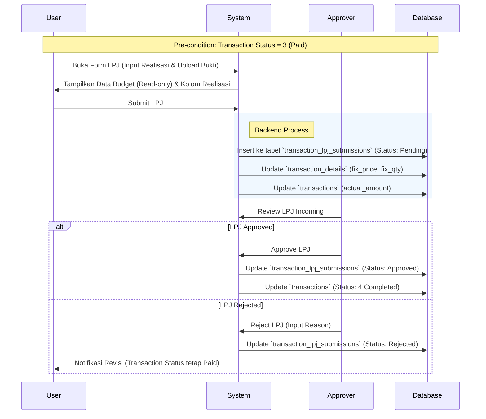

Berikut adalah draf dokumentasi teknis untuk pengembangan fitur **Laporan Pertanggungjawaban (LPJ)**. Dokumentasi ini disusun agar mudah dipahami oleh tim pengembang (Backend/Frontend) dan tim analisis.

---

# Dokumentasi Teknis: Fitur Laporan Pertanggungjawaban (LPJ)

**Project:** Finance & Budgeting System
**Modul:** Transaction Lifecycle Management
**Status Dokumen:** Draft v1.1 (Updated February 2026)

## 1. Ringkasan (Overview)

Fitur LPJ berfungsi sebagai proses pertanggungjawaban penggunaan dana setelah transaksi berstatus `Paid` (Dana Cair). User wajib melaporkan realisasi biaya (Actual) dibandingkan dengan pengajuan awal (Budget). Proses ini memiliki siklus persetujuan (*approval cycle*) tersendiri yang terpisah dari persetujuan pengajuan anggaran.

### 1.1 Implementasi Teknis

**Database Tables:**
- `lpj_approval_masters` - Master table untuk approver LPJ (employment_id, approval_sequence, is_active)
- `transaction_lpj_submissions` - Tabel submission LPJ
- `lpj_approval_details` - Snapshot approval chain

**Models:**
- `App\Models\LpjApprovalMaster`
- `App\Models\TransactionLpjSubmission`
- `App\Models\LpjApprovalDetail`

**Services:**
- `App\Services\LpjService\LpjService` (interface)
- `App\Services\LpjService\LpjServiceImpl` (implementation)

**Controllers:**
- `App\Http\Controllers\SubmissionController` - LPJ methods untuk user submission
- `App\Http\Controllers\LpjApprovalMasterController` - Management approver LPJ

**Routes:**
- User LPJ: `/admission/user/lpj/...`
- Admin LPJ Approver: `/lpj-approver/...`

## 2. Alur Proses (Workflow)

Berikut adalah diagram alur perubahan data dan status dari awal pencairan dana hingga LPJ selesai.



## 3. Perubahan Skema Database

Untuk mendukung fitur ini tanpa merusak integritas data approval transaksi awal, dibuat satu tabel baru dan pemanfaatan kolom yang sudah ada.

### 3.1. Tabel Baru: `transaction_lpj_submissions`

Tabel ini menyimpan *header* dari laporan pertanggungjawaban dan status approval-nya.

```sql
CREATE TABLE transaction_lpj_submissions (
    id BIGINT UNSIGNED AUTO_INCREMENT PRIMARY KEY,
    transaction_id BIGINT UNSIGNED NOT NULL,
    submission_date DATE NOT NULL COMMENT 'Tanggal lapor LPJ',
    realization_date DATE NOT NULL COMMENT 'Tanggal aktual belanja',
    proof_of_payment VARCHAR(255) COMMENT 'Path file upload bukti',
    
    -- Approval LPJ Logic
    status_approval ENUM('pending', 'approved', 'rejected') DEFAULT 'pending',
    rejection_reason TEXT NULL,
    approved_at TIMESTAMP NULL,
    approved_by BIGINT UNSIGNED NULL, -- ID User yang approve
    
    created_at TIMESTAMP NULL,
    updated_at TIMESTAMP NULL,
    
    CONSTRAINT fk_lpj_trx FOREIGN KEY (transaction_id) REFERENCES transactions(id) ON DELETE CASCADE
);

```

### 3.2. Pemanfaatan Tabel `transaction_details`

Tidak perlu menambah kolom baru, gunakan kolom yang sudah tersedia:

| Kolom Database | Fungsi di LPJ | Keterangan |
| --- | --- | --- |
| `fix_quantity` | Qty Realisasi | Diinput User saat LPJ |
| `fix_price` | Harga Satuan Realisasi | Diinput User saat LPJ |
| `fix_total` | Total Realisasi | `fix_quantity * fix_price` |
| `estimated_*` | Data Budget Awal | **Read-only** (Tidak boleh diedit saat LPJ) |

### 3.3. Update Tabel `transactions`

* **`actual_amount`**: Diupdate otomatis (Sum of `transaction_details.fix_total`) setiap kali LPJ disubmit.
* **`status`**: Akan berubah menjadi `4` (Completed) HANYA JIKA `transaction_lpj_submissions.status_approval` menjadi `approved`.

## 4. Spesifikasi API & Logika Backend

### A. Show Form LPJ

* **Endpoint:** `GET /api/transactions/{id}/lpj`
* **Logic:**
1. Pastikan `transactions.status == 3 (Paid)` atau `transactions.status == 2 (Approved)`.
2. Ambil data `transaction_details`.
3. **Frontend Note:** Mapping kolom `Submission` menggunakan data `estimated_*`. Mapping kolom `Realization` default-nya kosong (0) atau disamakan dengan estimated (opsional).


### B. Submit LPJ

* **Endpoint:** `POST /api/transactions/{id}/lpj`
* **Payload:**
```json
{
    "submission_date": "2026-02-05",
    "realization_date": "2026-02-04",
    "proof_file": (binary),
    "items": [
        { "detail_id": 101, "fix_qty": 2, "fix_price": 50000 },
        { "detail_id": 102, "fix_qty": 1, "fix_price": 100000 }
    ]
}

```


* **Logic:**
1. Validasi tanggal (Realisasi tidak boleh sebelum tanggal Submission Transaksi awal).
2. Upload file bukti ke storage.
3. Create record di `transaction_lpj_submissions` dengan status `pending`.
4. Looping `items` untuk update `transaction_details` (set `fix_total` = qty * price).
5. Hitung ulang `transactions.actual_amount`.


### C. Approval LPJ

* **Endpoint:** `POST /api/lpj/{lpj_id}/decide`
* **Payload:** `{ "action": "approve" | "reject", "reason": "..." }`
* **Logic:**
* **If Approve:**
* Update `transaction_lpj_submissions` -> `approved`.
* Update `transactions.status` -> `4` (Completed).


* **If Reject:**
* Update `transaction_lpj_submissions` -> `rejected`.
* Update `rejection_reason`.
* `transactions.status` **TIDAK** berubah (User harus submit ulang/edit via endpoint update).


## 5. Aturan Validasi (Validation Rules)

1. **Block Edit Budget:** User tidak boleh mengubah kolom `estimated` (Submission Value) saat proses LPJ. Data ini dikunci sebagai referensi.
2. **Variance Check (Opsional):** Jika `actual_amount` > `estimated_amount` (Over Budget), sistem bisa memberikan *warning* warna merah pada UI, namun tetap bisa disubmit (tergantung kebijakan perusahaan).
3. **Status Lock:** LPJ tidak bisa disubmit jika transaksi belum berstatus `Paid`.

## 6. Mockup Mapping (Sesuai Gambar User)

| Label Form | Data Source / Destination | Tipe Input |
| --- | --- | --- |
| **Submission Date** | `transaction_lpj_submissions.submission_date` | Date Picker |
| **Submission Value** | `transactions.estimated_amount` | Disabled / Text |
| **Realization Date** | `transaction_lpj_submissions.realization_date` | Date Picker |
| **Realization Value** | `transactions.actual_amount` | Auto Calc / Disabled |
| **Tabel: Realization Report** | `transaction_details.fix_*` | Number Input |
| **Attach Proof** | `transaction_lpj_submissions.proof_of_payment` | File Upload |