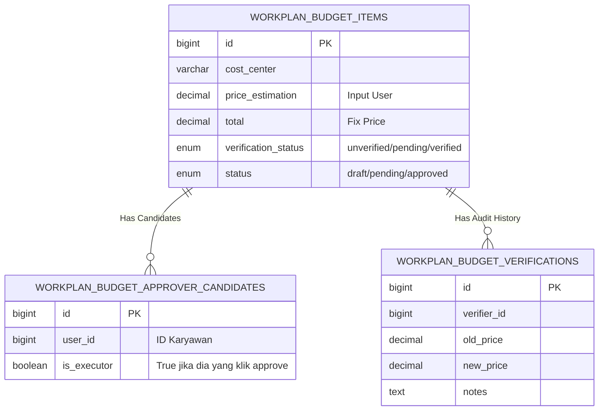

Berikut adalah **Dokumentasi Teknis Lengkap** untuk fitur **Budget Price Verification** dengan implementasi *Approver Candidate Snapshot* (Daftar Kandidat Verifikator) dan *Audit Trail*.

---

# Spesifikasi Teknis: Sistem Verifikasi Harga & Anggaran

## 1. Ringkasan Bisnis (Business Overview)

Fitur ini menjembatani proses antara pengajuan anggaran oleh User dengan persetujuan final oleh Finance. Sebelum masuk ke Finance, item anggaran harus divalidasi harganya (Price Verification) oleh departemen teknis terkait (misal: Item IT divalidasi oleh IT Dept, Item ATK oleh GA).

**Tujuan Utama:**

1. Memastikan `price_estimation` (estimasi user) dikoreksi menjadi `total` (fix price) oleh ahli yang relevan.
2. Menyimpan daftar "Siapa yang harus approve" (Candidates) secara statis saat pengajuan dibuat.
3. Mencatat riwayat perubahan harga (Audit Log).

---

## 2. Desain Database (ERD & Schema)

### Diagram Relasi (ERD)



### Struktur Tabel (SQL)

#### A. Tabel Utama (`workplan_budget_items`)

Menyimpan data item anggaran.

```sql
CREATE TABLE workplan_budget_items (
    id BIGINT UNSIGNED AUTO_INCREMENT PRIMARY KEY,
    description TEXT NOT NULL,
    cost_center VARCHAR(50) NOT NULL, -- Key untuk routing
    
    -- Nilai
    price_estimation DECIMAL(15,2) DEFAULT 0.00, -- User Input
    total DECIMAL(15,2) DEFAULT 0.00,            -- Verificator Input (Final)
    
    -- Status
    verification_status ENUM('unverified', 'pending', 'verified', 'rejected') DEFAULT 'unverified',
    status ENUM('draft', 'pending', 'approved', 'rejected') DEFAULT 'draft',
    
    -- Metadata
    created_at TIMESTAMP DEFAULT CURRENT_TIMESTAMP,
    updated_at TIMESTAMP DEFAULT CURRENT_TIMESTAMP ON UPDATE CURRENT_TIMESTAMP
);

```

#### B. Tabel Kandidat Verifikator (`workplan_budget_approver_candidates`)

**[PENTING]** Tabel ini diisi otomatis saat user melakukan SUBMIT. Berisi daftar user ID yang berhak melakukan verifikasi pada item tersebut.

```sql
CREATE TABLE workplan_budget_approver_candidates (
    id BIGINT UNSIGNED AUTO_INCREMENT PRIMARY KEY,
    workplan_budget_item_id BIGINT UNSIGNED NOT NULL,
    
    -- User ID yang berhak approve (diambil dari Master Mapping saat submit)
    user_id BIGINT UNSIGNED NOT NULL, 
    
    -- Penanda: Apakah user ini yang akhirnya melakukan eksekusi approval?
    is_executor BOOLEAN DEFAULT FALSE, 
    
    created_at TIMESTAMP DEFAULT CURRENT_TIMESTAMP,
    
    FOREIGN KEY (workplan_budget_item_id) REFERENCES workplan_budget_items(id) ON DELETE CASCADE,
    UNIQUE KEY unique_candidate (workplan_budget_item_id, user_id)
);

```

#### C. Tabel Audit Trail (`workplan_budget_verifications`)

Mencatat sejarah siapa yang mengubah harga dan kapan.

```sql
CREATE TABLE workplan_budget_verifications (
    id BIGINT UNSIGNED AUTO_INCREMENT PRIMARY KEY,
    workplan_budget_item_id BIGINT UNSIGNED NOT NULL,
    
    verifier_id BIGINT UNSIGNED NOT NULL, -- User yang melakukan aksi
    
    submitted_price_estimation DECIMAL(15,2) NOT NULL, -- Harga Awal
    verified_price_total DECIMAL(15,2) NOT NULL,       -- Harga Baru
    notes TEXT,
    
    verified_at TIMESTAMP DEFAULT CURRENT_TIMESTAMP,
    
    FOREIGN KEY (workplan_budget_item_id) REFERENCES workplan_budget_items(id) ON DELETE CASCADE
);

```

---

## 3. Alur Logika (Flow Logic)

Berikut adalah logika backend yang harus diimplementasikan pada Controller aplikasi Anda.

### Phase 1: Submission (User Requester)

*Trigger: User menekan tombol "Submit" pada draft anggaran.*

1. **Validasi:** Pastikan data mandatory terisi.
2. **Mapping Logic:**
* Ambil `cost_center` dari item tersebut (misal: "IT-OPS").
* Cari di tabel Master (`price_verification_code` & `price_verification_user`) job position apa saja yang handle "IT-OPS".
* Ambil list `user_id` yang menjabat posisi tersebut (misal: ID 32 dan ID 45).


3. **Snapshot Candidates:**
* **INSERT** ke tabel `workplan_budget_approver_candidates` untuk User ID 32 dan 45.


4. **Update Status:**
* Update `workplan_budget_items`: Set `verification_status` = 'pending'.


### Phase 2: Verification (Verifikator)

*Trigger: Verifikator (misal User ID 32) membuka Dashboard.*

1. **Load List:**
* Query: `SELECT * FROM workplan_budget_items JOIN workplan_budget_approver_candidates ... WHERE user_id = 32 AND verification_status = 'pending'`.


2. **Action:** User ID 32 menginput harga fix (misal: 5.000.000) dan klik "Approve".
3. **Database Transaction (Atomic):**
* **Cek Konflik:** Pastikan status masih 'pending'.
* **Update Item:** Set `total` = 5.000.000, `verification_status` = 'verified'.
* **Insert Audit:** Catat ke `workplan_budget_verifications` (Verifier: 32, Old: 4.5jt, New: 5jt).
* **Update Candidate:** Update `workplan_budget_approver_candidates` set `is_executor` = TRUE where `user_id` = 32.


### Phase 3: Finance Approval

*Trigger: Finance Team.*

1. Finance hanya melihat item dengan `verification_status = 'verified'`.
2. Finance melakukan final approval (mengubah kolom `status` utama menjadi 'approved').

---

## 4. Diagram Alur Sistem (Flowchart)

```mermaid
flowchart TD
    Start((Start)) --> Draft[User Create Draft]
    Draft --> Submit{User Submit?}
    
    %% Logic Generate Candidates
    Submit -- Yes --> GetCC[Get Cost Center Code]
    GetCC --> LookupMaster[Lookup Master Verification Table]
    LookupMaster --> GetUsers[Get List of Eligible User IDs]
    GetUsers --> InsertCand[INSERT into\napprover_candidates table]
    InsertCand --> UpdateStatus[Update verification_status\n= PENDING]
    
    %% Logic Verification
    UpdateStatus --> WaitVerif[Waiting for Verification]
    WaitVerif --> VerifierAction[Verifier (ID 32) Opens Dashboard]
    VerifierAction --> InputPrice[Input Fix Price (Total)]
    InputPrice --> SaveVerif{Save Verification?}
    
    %% Logic Saving
    SaveVerif -- Yes --> DBTrans(Start DB Transaction)
    DBTrans --> UpdItem[Update workplan_budget_items\nSet TOTAL = Input]
    UpdItem --> InsLog[Insert workplan_budget_verifications\n(Audit Log)]
    InsLog --> UpdCand[Update approver_candidates\nSet is_executor = TRUE]
    UpdCand --> Commit(Commit Transaction)
    
    Commit --> Finish((Ready for Finance))

```

---

## 5. Implementasi Coding (Pseudocode Controller)

Berikut adalah gambaran logika kodingan (Laravel-style) untuk mempermudah developer Anda.

### A. Logic saat Submit (Generate Candidates)

```php
public function submitBudget($itemId) {
    DB::transaction(function () use ($itemId) {
        $item = WorkplanBudgetItem::find($itemId);
        
        // 1. Cari Siapa yang berhak approve berdasarkan Cost Center
        // (Logic join ke tabel master price_verification)
        $eligibleUserIds = $this->getApproversByCostCenter($item->cost_center); 
        
        // 2. Simpan ke tabel Candidates (Snapshot)
        foreach ($eligibleUserIds as $userId) {
            ApproverCandidate::create([
                'workplan_budget_item_id' => $item->id,
                'user_id' => $userId
            ]);
        }
        
        // 3. Update Status
        $item->verification_status = 'pending';
        $item->save();
    });
}

```

### B. Logic saat Approve (Verification Action)

```php
public function verifyBudget(Request $request, $itemId) {
    $verifierId = Auth::id(); // User ID 32
    $fixPrice = $request->input('fix_price'); // 5.000.000
    
    DB::transaction(function () use ($itemId, $verifierId, $fixPrice) {
        $item = WorkplanBudgetItem::lockForUpdate()->find($itemId);
        
        // Guard: Cek apakah sudah didahului orang lain
        if ($item->verification_status != 'pending') {
            throw new Exception("Item ini sudah diverifikasi user lain.");
        }
        
        // 1. Simpan Audit Log
        VerificationLog::create([
            'workplan_budget_item_id' => $item->id,
            'verifier_id' => $verifierId,
            'submitted_price_estimation' => $item->price_estimation,
            'verified_price_total' => $fixPrice,
            'notes' => $request->input('notes')
        ]);
        
        // 2. Update Item Utama
        $item->total = $fixPrice;
        $item->verification_status = 'verified';
        $item->save();
        
        // 3. Tandai Eksekutor di tabel Candidates
        ApproverCandidate::where('workplan_budget_item_id', $itemId)
            ->where('user_id', $verifierId)
            ->update(['is_executor' => true]);
    });
}

```

---

## 6. Implementasi Aktual (Files Reference)

### Files yang Dibuat/Dimodifikasi

| File | Deskripsi |
|------|-----------|
| `app/Services/VerificationBudgetService/VerificationBudgetService.php` | Interface service |
| `app/Services/VerificationBudgetService/VerificationBudgetServiceImpl.php` | Implementasi logika bisnis |
| `app/Http/Controllers/VerificationBudgetController.php` | Controller untuk endpoints |
| `app/Models/WorkplanBudgetApprover.php` | Model kandidat verifikator |
| `app/Models/WorkplanBudgetVerification.php` | Model audit trail |
| `app/Models/WorkplanBudgetItem.php` | Model utama (ditambah relationships) |
| `routes/web.php` | Routes untuk verification endpoints |
| `resources/views/pages/budget/verification-budget.blade.php` | Dashboard verifikator |
| `public/assets/js/budget-user.js` | JavaScript frontend |

### API Endpoints

| Method | Endpoint | Deskripsi |
|--------|----------|-----------|
| `GET` | `/budget-verification` | Dashboard verifikator |
| `GET` | `/budget-verification/pending` | List item pending verification untuk user |
| `POST` | `/budget-verification/{itemId}/submit` | Submit item untuk verifikasi |
| `POST` | `/budget-verification/{itemId}/verify` | Verifikasi item (set fix price) |
| `POST` | `/budget-verification/{itemId}/reject` | Tolak verifikasi |
| `GET` | `/budget-verification/{itemId}/status` | Status verifikasi item |
| `GET` | `/budget-verification/{itemId}/can-verify` | Cek apakah user bisa verifikasi |

### Flow User

```
User membuat budget item (draft)
          ↓
User klik "Submit for Verification"
          ↓
System: Generate kandidat verifikator dari mapping cost_center
          ↓
Item status: verification_status = 'pending'
          ↓
Verifikator melihat item di Dashboard Verification
          ↓
Verifikator input fix price + klik "Verify"
          ↓
System: Update total, verification_status = 'verified'
          ↓
System: AUTO-SUBMIT untuk approval (memanggil submitForApproval)
          ↓
Item masuk ke approval workflow
```

### Fitur Auto-Submit Approval

Setelah verifikasi berhasil, sistem **otomatis** memanggil `WorkplanBudgetItemApprovalService::submitForApproval()` untuk memulai proses approval. User tidak perlu manual submit lagi.

---

Dokumentasi ini mencakup seluruh kebutuhan: struktur data yang mendukung *multiple candidates*, pemisahan status, audit trail yang akurat, dan alur logika yang aman dari konflik data.